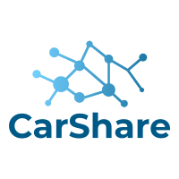

  

## Descripción

Este proyecto despliega un manual de usuario para la aplicación Car Share.
La aplicación CarShare está destinada a la generación de horarios semanales para el reparto de conducción en un grupo

## Manual para CarShare

Este es un proyecto desarrollado en [Angular](https://github.com/angular/angular-cli) version 11.0.4.

La aplicación tiene dos partes:

[Cliente](https://github.com/rnavas81/ClienteRuedas)

[Servidor](https://github.com/rnavas81/ServidorRuedas)
